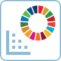

# World Data + SDG-verktyg

<figure><figcaption></figcaption></figure>

### 1. FN:s globala mål för hållbar utveckling (SDG) verktyg 

**Beskrivning:**

1. Lär dig om SDG-statusen i olika länder.
2. Jämför SDG-poäng och rankningar mellan länder.
3. Använd SDG-landjämförelsefrasgeneratorn.

### 2. Verktyg för att lära om landsskillnader och datavisualisering 

**Beskrivning:**

Jämför två länder för att förstå skillnader i socioekonomisk, hälsorelaterad och demografisk data. Använd datavisualiseringar och en dynamisk frasgenerator för djupare insikter.

### 3. Verktyg för jämförelse av landsdata 

**Beskrivning:**

Ett omfattande verktyg för att jämföra landsdata, inklusive Lorenz-kurvor, Broken Ladder-skalan, SDG-utmaningar och grupper av länder.

### 4. Verktyg för jämförelse av landgrupper 

**Beskrivning:**

Utforska mer än 100 landgrupper. Lär dig om skillnader mellan länder inom dessa grupper.
