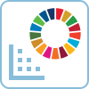

# Left Bar

## <mark style="background-color:red;">Left Bar of the Dashboard</mark>

### <mark style="background-color:red;">1. Home</mark>&#x20;

<figure><figcaption></figcaption></figure>

<figure><figcaption>
After scrolling down the home page
</figcaption></figure>

Home Page gives you an overview of the all the major features that are available for you as a School/University Admin.&#x20;

**Class Creation Tools** - can be used to assign various tasks and assignments to students. Global Citizensip Assignments, Lesson Plans and their use cases are further discussed.

**School/University Management and Data** - allows you to check the number of Students and their status. Number of Teachers/Professors and their status can also be checked. School/University game data gives you a comprehensive view of the statistics and data of all the classes you have created. Personal game data comprises of statistics and information about the games you personally participated in.

### <mark style="background-color:red;">2. Device List</mark>

Gives you control over the devices where your account is logged in. RealLives allows School/University Admins to use their account on 3 different devices. If for any reason the user wants to remove a device's access they can do so by clicking on the 'Remove Device' button.

<figure><figcaption></figcaption></figure>

### <mark style="background-color:red;">3. My Game Dashboard</mark>

A game dashboard is a centralized interface displaying essential game information such as player stats, achievements, and progress tracking.&#x20;

<figure><figcaption></figcaption></figure>

RealLives My Game Dashboard is divided into three parts -

**SDG chosen by me while creating a life** -

The Sustainable Development Goals (SDGs) by the United Nations are a set of 17 interconnected global objectives aimed at addressing pressing challenges such as poverty, inequality, climate change, and environmental degradation. When you want play a life, you can choose any SDG and start your life. You can do so by clicking on Live a Life on your home page then choosing the third option shown in the page below.

<figure><figcaption></figcaption></figure>

#### Organs Donated by me -&#x20;

Shows the number of Organs donated by you in all of the lives played.&#x20;

#### My Gameplay Data -&#x20;

Gives information about the lives which have been completed or are incomplete, Countries covered while playing and also the letters written and SDG comments. Number of Male and Female lives are also specified.

### <mark style="background-color:red;">4. World Data + SDG Tools</mark>

**RealLives World Data Learning Tools**

<figure><figcaption></figcaption></figure>

### 1. UN's Sustainable Development Goals (SDGs) Tool  

**Description:**

1\. Learn SDG status of Countries.\
2\. Compare SDG country score and rank.\
3\. SDG country comparative statement generator.

### &#x20;2. Country Disparity Learning Tool & Data Visualisation  

**Description:**

Compare two countries to understand the disparity of socio-economic, health and demographic data with the help of data visualization and dynamic statements generated by the data.

### 3. Compare Country Data 

**Description:**

A complete tool for comparing country data with the Lorenz curve, broken ladder scale, SDG challenges and country groups.

### 4. Country Groups Comparison 

**Description:**

Experience 100+ country groups. Learn about the disparities between countries within a country group.
