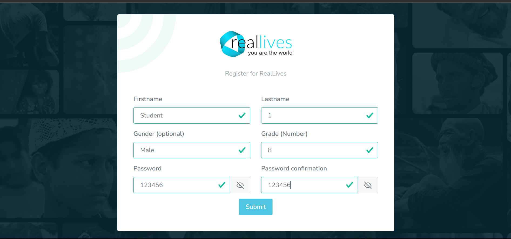

# Studenter

## <mark style="background-color:blue;">Lägga till/Importera studenter</mark>

Vi har tre sätt att importera studenter till spelet -

1. Importera med hjälp av e-post (Rekommenderas)
2. Importera utan e-post
3. Lägga till enskild student

Låt oss se hur varje metod fungerar.

### <mark style="background-color:blue;">1. Importera studenter med hjälp av e-post</mark>

**För skolor/universitet som använder e-post för studenter rekommenderas det att ange studentens e-postadress. Ska användas när flera studenter måste läggas till.**

* När uppgifter och klasser skapas får studenter meddelanden via e-post.
* Studenter som importeras med hjälp av e-post får sina användarnamn inställda som den e-postadress som anges här.

När du väljer det här alternativet öppnas följande sida.

<figure><figcaption>
Importera studenter via e-post
</figcaption></figure>

### Steg 1 -

Klicka först på den röda knappen som laddar ner ett exempel på ett Excel-ark som detta -

<figure><figcaption>
Exempel på Excel-ark
</figcaption></figure>

Så här ser exempelarket ut. Som du kan se finns det en kolumn som säger användarnamn. Som referens har vi redan lagt till två e-postadresser. Allt du behöver göra är att fylla i e-postadresserna till de studenter du vill lägga till i spelet. När du har lagt till deras e-postadresser, spara detta Excel-ark.

### Steg 2 -

Klicka på bläddra-knappen som är markerad med vit färg precis under den röda knappen. Efter att ha gjort detta öppnas en sida som ser ut så här.

<figure><figcaption></figcaption></figure>

Allt du behöver göra är att välja Excel-filen där du har fyllt i e-postadresserna. När detta är klart, klicka på Importera-knappen som finns under bläddra-knappen. Du kommer att få en bekräftelse på att importen lyckades. Nu får studenterna i listan unika länkar till sina e-postadresser, och de behöver bara klicka på dessa länkar och registrera sig på RealLives.

### <mark style="background-color:blue;">Exempel på hur ett e-postmeddelande ser ut och hur man registrerar sig för första gången</mark>

<figure><figcaption>
E-post mottaget av studenten
</figcaption></figure>

#### När studenten har mottagit e-postmeddelandet behöver de bara klicka på registreringsknappen och en ny flik öppnas som så här -

<figure><figcaption>
Registrering för första gången
</figcaption></figure>

#### Studenten måste fylla i alla angivna parametrar och klicka på skicka-knappen. Nu skapas ett nytt konto för studenten som de kan komma åt med sin e-post som användarnamn och lösenordet de angav vid registreringen.

### <mark style="background-color:red;">Obs -</mark>

Se till att du anger e-postadresser som inte redan är registrerade på RealLives. Om du anger e-postadresser som redan är registrerade får du ett sådant meddelande -

<figure><figcaption>
Felmeddelande för redan använda e-postadresser
</figcaption></figure>
---
description: >-
  Avsnittet Studenter gör det möjligt för skoladministratörer att effektivt hantera
  studentkonton, importera studenter till systemet och övervaka registreringsstatus.
---

# Studenter

## <mark style="background-color:blue;">Lägga till/Importera studenter</mark>

Vi har tre sätt att importera studenter till spelet -

1. Importera med hjälp av e-post (Rekommenderas)
2. Importera utan e-post
3. Lägga till enskild student

Låt oss se hur varje metod fungerar.

### <mark style="background-color:blue;">1. Importera studenter med hjälp av e-post</mark>

**För skolor/universitet som använder e-post för studenter rekommenderas det att ange studentens e-postadress. Ska användas när flera studenter måste läggas till.**

* När uppgifter och klasser skapas får studenter meddelanden via e-post.
* Studenter som importeras med hjälp av e-post får sina användarnamn inställda som den e-postadress som anges här.

När du väljer det här alternativet öppnas följande sida.

<figure><figcaption>
Importera studenter via e-post
</figcaption></figure>

### Steg 1 -

Klicka först på den röda knappen som laddar ner ett exempel på ett Excel-ark som detta -

<figure><figcaption>
Exempel på Excel-ark
</figcaption></figure>

Så här ser exempelarket ut. Som du kan se finns det en kolumn som säger användarnamn. Som referens har vi redan lagt till två e-postadresser. Allt du behöver göra är att fylla i e-postadresserna till de studenter du vill lägga till i spelet. När du har lagt till deras e-postadresser, spara detta Excel-ark.

### Steg 2 -

Klicka på bläddra-knappen som är markerad med vit färg precis under den röda knappen. Efter att ha gjort detta öppnas en sida som ser ut så här.

<figure><figcaption></figcaption></figure>

Allt du behöver göra är att välja Excel-filen där du har fyllt i e-postadresserna. När detta är klart, klicka på Importera-knappen som finns under bläddra-knappen. Du kommer att få en bekräftelse på att importen lyckades. Nu får studenterna i listan unika länkar till sina e-postadresser, och de behöver bara klicka på dessa länkar och registrera sig på RealLives.

### <mark style="background-color:blue;">Exempel på hur ett e-postmeddelande ser ut och hur man registrerar sig för första gången</mark>

<figure><figcaption>
E-post mottaget av studenten
</figcaption></figure>

#### När studenten har mottagit e-postmeddelandet behöver de bara klicka på registreringsknappen och en ny flik öppnas som så här -

<figure><figcaption>
Registrering för första gången
</figcaption></figure>

#### Studenten måste fylla i alla angivna parametrar och klicka på skicka-knappen. Nu skapas ett nytt konto för studenten som de kan komma åt med sin e-post som användarnamn och lösenordet de angav vid registreringen.

### <mark style="background-color:red;">Obs -</mark>

Se till att du anger e-postadresser som inte redan är registrerade på RealLives. Om du anger e-postadresser som redan är registrerade får du ett sådant meddelande -

<figure><figcaption>
Felmeddelande för redan använda e-postadresser
</figcaption></figure>
### <mark style="background-color:blue;">Scenario 2 -</mark>

Det andra scenariot är där studenten inte har en giltig skol-/universitets-e-postadress. I ett sådant fall kommer läraren/professorn att fylla i all nödvändig information förutom e-postadressen och sedan spara det.

<figure><figcaption></figcaption></figure>

Därefter kan läraren/professorn kontrollera om studenten har lagts till i spelet genom att gå till avsnittet **Studenter** i vänstra menyn på instrumentpanelen och klicka på **Tilldelade studenter**. Som du kan se har Chuck Bass lagts till framgångsrikt.

<figure><figcaption></figcaption></figure>

Eftersom vi inte lade till e-postadresser för studenterna kan de inte använda sina e-postadresser för att logga in. Därför måste studenterna använda de unika användarnamn som genererats av systemet för att logga in i spelet. Dessutom är registreringsprocessen för studenter som lagts till utan e-post annorlunda.

Studenten måste gå till inloggningssidan [https://reallivesworld.com/login](https://reallivesworld.com/login)

När de är där måste de ange sitt unika användarnamn (i detta fall **chuckbass10000884**, som anges i användarnamnskolumnen) som tillhandahålls av läraren/professorn och standardlösenordet som ställts in av läraren/professorn.

När studenten loggar in i spelet kan de ändra sitt lösenord genom att besöka sin profil och gå till **Mitt konto** för ökad säkerhet.

<figure><figcaption></figcaption></figure>

***
