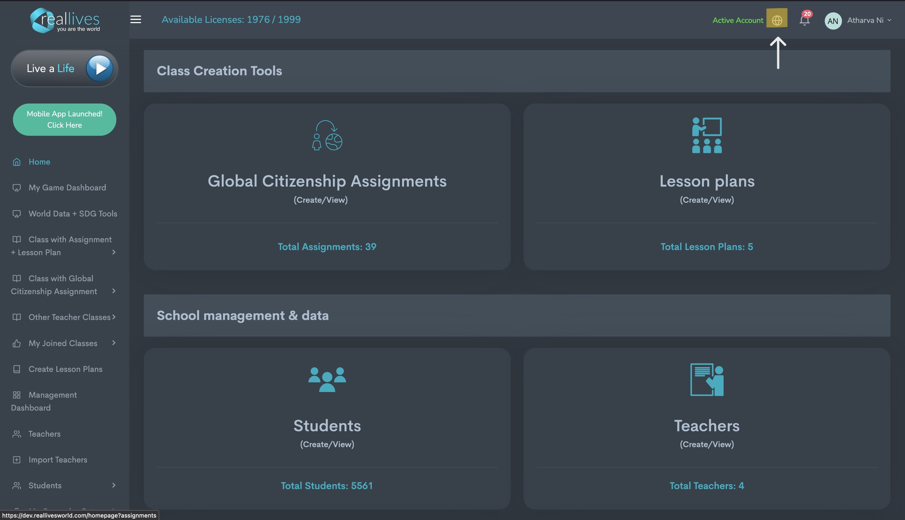

# Top Bar

## <mark style="background-color:blue;">Top Bar of the Dashboard</mark>

### <mark style="background-color:blue;">1. User Profile</mark>

<figure><figcaption>
Refer to the higlighted portion
</figcaption></figure>

Your name will be displayed on the top right corner along with a circular image. On clicking it, you get three different options.

* My Account - can be used to edit information like name, username, password, address and email.
* Edit Avatar - can be used to edit image to be displayed along with your username.
* Logout - for logging out of the current session.

### <mark style="background-color:blue;">2. Notification Block</mark>

<figure><figcaption>
Refer to the highlighted portion
</figcaption></figure>

The notification panel symbolised by a bell icon provides real-time updates on various events or activities relevant to the user. These updates can include new reminders, system alerts, or changes in status.

### <mark style="background-color:blue;">3. Language</mark>

<figure><figcaption>
Refer to the highlighted portion
</figcaption></figure>

The world icon on the left side of the notification block helps to change the language, in which you want to interact with RealLives. Currently, English and Korean are the two languages which are supported with support for more languages in the near future.

### Note - Active Account shows the current status of your account.

### <mark style="background-color:blue;">4. Available Licenses</mark>

<figure><figcaption>
Refer to the highlighted portion
</figcaption></figure>

Situated on top of the dashboard, available licenses displays the total capacity of users which can be added by the School/University admin and also helps in indicating the current users that have been allocated. One student equals one license.
