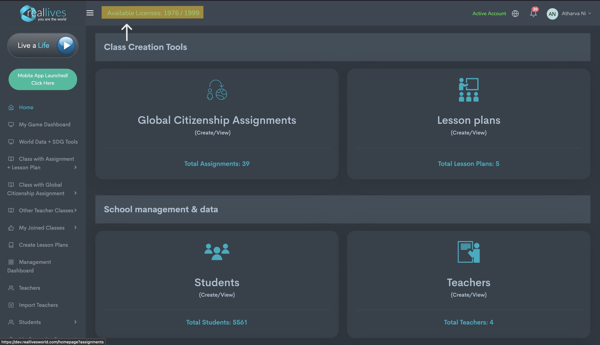

# 상단 바

## <mark style="background-color:blue;">대시보드의 상단 바</mark>

### <mark style="background-color:blue;">1. 사용자 프로필</mark>

<figure><figcaption>
강조된 부분을 참조하세요
</figcaption></figure>

사용자의 이름은 우측 상단에 원형 이미지와 함께 표시됩니다. 이를 클릭하면 세 가지 다른 옵션이 나타납니다.

* 내 계정 - 이름, 사용자 이름, 비밀번호, 주소 및 이메일과 같은 정보를 수정할 수 있습니다.
* 아바타 편집 - 사용자 이름과 함께 표시될 이미지를 수정할 수 있습니다.
* 로그아웃 - 현재 세션에서 로그아웃합니다.

### <mark style="background-color:blue;">2. 알림 블록</mark>

<figure><figcaption>
강조된 부분을 참조하세요
</figcaption></figure>

종 모양 아이콘으로 표시된 알림 패널은 사용자에게 관련된 다양한 이벤트나 활동에 대한 실시간 업데이트를 제공합니다. 이러한 업데이트는 새로운 알림, 시스템 경고 또는 상태 변경 등을 포함할 수 있습니다.

### <mark style="background-color:blue;">3. 언어</mark>

<figure><figcaption>
강조된 부분을 참조하세요
</figcaption></figure>

알림 블록 왼쪽에 있는 세계 아이콘은 RealLives와 상호작용할 때 사용할 언어를 변경할 수 있도록 도와줍니다. 현재 영어와 한국어가 지원되며, 가까운 시일 내에 더 많은 언어가 추가될 예정입니다.

### 참고 - 활성 계정은 계정의 현재 상태를 표시합니다.

### <mark style="background-color:blue;">4. 사용 가능한 라이선스</mark>

<figure><figcaption>
강조된 부분을 참조하세요
</figcaption></figure>

대시보드 상단에 위치한 사용 가능한 라이선스는 학교/대학 관리자가 추가할 수 있는 사용자 총 용량을 표시하며, 현재 할당된 사용자 수를 나타냅니다. 한 명의 학생은 하나의 라이선스에 해당됩니다.
