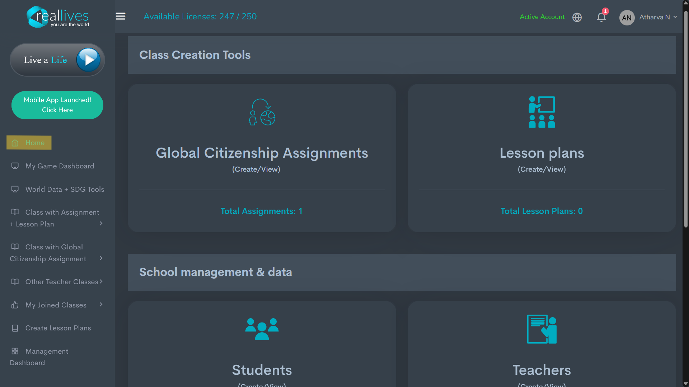

# Toppmeny

## <mark style="background-color:red;">Toppmenyn i Instrumentpanelen</mark>

### <mark style="background-color:red;">1. Hem</mark>&#x20;

<figure><figcaption></figcaption></figure>

<figure><figcaption>
Efter att ha scrollat ner på hemsidan
</figcaption></figure>

Hemsidan ger dig en översikt över alla de viktigaste funktionerna som är tillgängliga för dig som Skoladministratör.&#x20;

**Verktyg för Klasskapande** - kan användas för att tilldela olika uppgifter och uppdrag till eleverna. Globalt Medborgarskapsuppdrag, lektionsplaner och deras användningsområden diskuteras vidare.

**Skolhantering och Data** - låter dig kontrollera antalet elever och deras status. Antal lärare och deras status kan också kontrolleras. Skolspelsdata ger dig en omfattande översikt över statistik och data för alla klasser du har skapat. Personlig speldatav består av statistik och information om de spel du personligen deltagit i.

### <mark style="background-color:red;">2. Enhetslista</mark>

Ger dig kontroll över de enheter där ditt konto är inloggat. RealLives tillåter Skoladministratörer att använda sitt konto på 3 olika enheter. Om användaren av någon anledning vill ta bort en enhets åtkomst kan de göra det genom att klicka på knappen 'Ta bort enhet'.

<figure><figcaption></figcaption></figure>

### <mark style="background-color:red;">3. Min Spelinstrumentpanel</mark>

En spelinstrumentpanel är ett centraliserat gränssnitt som visar viktig spelinformation som spelarstatistik, prestationer och spårning av framsteg.&#x20;

<figure><figcaption></figcaption></figure>

RealLives Min Spelinstrumentpanel är indelad i tre delar -

**SDG som jag valt när jag skapade ett liv** -

De hållbara utvecklingsmålen (SDG) av FN är en uppsättning av 17 sammanlänkade globala mål som syftar till att ta itu med pressande utmaningar som fattigdom, ojämlikhet, klimatförändringar och miljöförstöring. När du vill spela ett liv kan du välja ett SDG och starta ditt liv. Du kan göra detta genom att klicka på Lev ett Liv på din hemsida och sedan välja det tredje alternativet som visas på sidan nedan.

<figure><figcaption></figcaption></figure>

#### Organ donerade av mig -&#x20;

Visar antalet organ som donerats av dig i alla liv som spelats.&#x20;

#### Min Speldatab -&#x20;

Ger information om de liv som har slutförts eller är ofullständiga, länder som täckts under spelet och även de brev som skrivits och SDG-kommentarer. Antal manliga och kvinnliga liv specificeras också.

### <mark style="background-color:red;">4. Världsdata + SDG-verktyg</mark>

**RealLives Världsdata Lärverktyg**

<figure><figcaption></figcaption></figure>

### 1. FN:s Hållbara Utvecklingsmål (SDG) Verktyg  

**Beskrivning:**

1. Lär dig om SDG-statusen för länder.2. Jämför SDG-landspoäng och rang.3. SDG-landsjämförelsedeclarationsgenerator.

### &#x20;2. Landsdiskriminering Lärverktyg & Datavisualisering  

**Beskrivning:**

Jämför två länder för att förstå skillnaden i socioekonomiska, hälso- och demografiska data med hjälp av datavisualisering och dynamiska deklarationer genererade av data.

### 3. Jämför Landsdata 

**Beskrivning:**

Ett komplett verktyg för att jämföra landsdata med Lorenzkurvan, trasig stegeskala, SDG-utmaningar och landgrupper.

### 4. Landgrupps Jämförelse 

**Beskrivning:**

Upplev 100+ landgrupper. Lär dig om skillnaderna mellan länder inom en landgrupp.
