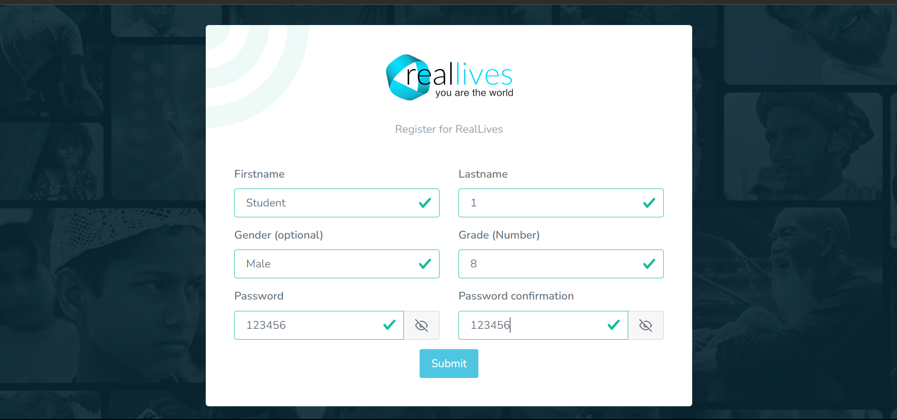

# Adding Students

## <mark style="background-color:blue;">Adding/Importing Students</mark>

We have three ways to Import Students into the game -

1. Importing with the help of E-mail (Reccomended)
2. Importing without E-mail
3. Adding Single Student&#x20;

Let's see how each method works.

### <mark style="background-color:blue;">1. Importing Students with the help of E-mail</mark>

**For Schools/Universities that use email for students, it is recommended to provide the student's email address. Should be used when multiple students have to be added.**

* When assignments and classes are created, students will receive notifications via email.
* Students imported using emails have their usernames set as the email which is provided here.

Once you choose this option the following page will open up.

<figure><figcaption>
Import Students by E-mail
</figcaption></figure>

### Step 1 -

First click on the red button which will download a sample excel sheet like this -

<figure><figcaption>
Sample Excel Sheet
</figcaption></figure>

This is how the sample excel sheet will look like, as you can see there is a column which says username. For reference we have already added two e-mails. All you have to do is fill the e-mails of the students you wish to add to the game. Once you add their e-mails, save this excel sheet.

### Step 2 -

Click on the browse button which is highlighted by white colour just below the red button. After doing this a page like this will open up.

<figure><figcaption></figcaption></figure>

All you have to do is to select the Excel file in which you have filled the e-mails. Once done, then click on the Import button situated below the browse button. You will get Student Import Successful Prompt. Now the students who were in the list will recieve unique links on their e-mails, all they have to do is click those links and register themselves on realLives.

### <mark style="background-color:blue;">Example of how an e-mail looks and how to register for the first time</mark>

<figure><figcaption>
E-mail recieved by the student
</figcaption></figure>

#### Once the Student recieves the e-mail, they have to just click on the register button and a new tab will be opened like so -

<figure><figcaption>
Registration for the first time
</figcaption></figure>

#### The student has to fill in all the parameters mentioned, then click on the submit button. Now a new account will be created for the student which they can access by using their e-mail as the username and the password they have set while registering.

### <mark style="background-color:red;">Note -</mark>&#x20;

Make sure you enter e-mails which have not been previously registered on realLives. If you enter e-mails which have already been registered, you will get such a prompt -&#x20;

<figure><figcaption>
Error prompt for already used e-mails
</figcaption></figure>

### <mark style="background-color:blue;">2. Importing Students without e-mail</mark>

**If your School/University doesn't provide e-mails to the students:**

* Students will only receive notifications about new assignments and classes through their dashboards.
* Students imported by selecting this option will have their usernames set by the system. They can later change the username from their dashboard.

Once you choose this option the following page will open up.

<figure><figcaption>
Import Students without e-mail
</figcaption></figure>

### Step 1 -

First click on the red button which will download a sample excel sheet like this -

<figure><figcaption>
Sample Excel Sheet
</figcaption></figure>

This is how the sample excel sheet will look like, as you can see there are 5 columns Firstname, Lastname, Age, Gender and Grade. For reference we have already added information of two students. All you have to do is fill the information of the students you wish to add to the game. Once you add their information, save this excel sheet.

### Step 2 -

Click on the browse button which is highlighted by white colour just below the red button. After doing so, a page like this will open up.

<figure><figcaption></figcaption></figure>

All you have to do is to select the Excel file in which you have filled the information about the students. Once done, then click on the Save button situated below the browse button. You will get Student Import Successful Prompt.&#x20;

### Step 3 -

You can check if the students have been added by going to the Students tab located in the Left Bar of the Dashboard and clicking on Allocated Students.

<figure><figcaption></figcaption></figure>

For reference we had added John's and Linda's information in the Excel sheet above and uploaded it on the game, hence John and Linda have been added as students into the system.

### <mark style="background-color:red;">Note -</mark>

Because we did not add e-mails of students, the students cannot use their e-mails to log in. Hence, the students will have to use the unique usernames that have been generated by the system, to log in to the game. Also, the registration process for students who have been added to the game without their e-mail is different.&#x20;

The student will have to go to the login page [https://reallivesworld.com/login](https://reallivesworld.com/login)&#x20;

Once here, they will have to enter their unique username provided by the Teacher/Professor, and the default password which will be - 12345678

Upon logging in the game the Student can change their password by visiting their profile and going to My Account for enhanced privacy.

<figure><figcaption></figcaption></figure>

### <mark style="background-color:blue;">3. Adding Single Student</mark>

**Add a single student by filling up the form manually. Should be used only when a single student is to be added. If there are multiple students, the Teacher/Professor can use the other two ways mentioned above which are less time consuming and much more efficient.**

There are two ways you can add the student manually.&#x20;

### <mark style="background-color:blue;">Scenario 1 -</mark>

The first scenario would be where the student has a valid School/University e-mail. The Teacher/Professor can go ahead by entering all the necessary information and setting the password by themselves, which the student can change later on. The e-mail entered will act as the username for the student, and all updates will be sent on that e-mail. Once the Teacher/Professor has filled in all the details, they have to save it.&#x20;

<figure><figcaption></figcaption></figure>

Then, to check if the student has been added to the game, the Teacher/Professor can go to the Students section of the Left Bar of the dashboard and then click on Allocated Students.

&#x20;As you can see Linda Jones has been successfully added.

<figure><figcaption></figcaption></figure>

After this the student can go to - [https://reallivesworld.com/login](https://reallivesworld.com/login)

Here, they would enter their e-mail as the username and the password which is set by the Teacher/Professor.

<figure><figcaption>
Student login
</figcaption></figure>

### <mark style="background-color:blue;">Scenario 2 -</mark>

The second scenario would be where the student does not have a valid School/University e-mail. In such a case the Teacher/Professor will fill all the necessary information except the e-mail and save it.&#x20;

<figure><figcaption></figcaption></figure>

Then, to check if the student has been added to the game, the Teacher/Professor can go to the Students section of the left part of the dashboard and then click on Allocated Students. As you can see Chuck Bass has been successfully added.

<figure><figcaption></figcaption></figure>

Because we did not add e-mails of students, the students cannot use their e-mails to log in. Hence, the students will have to use the unique usernames that have been generated by the system to log in to the game. Also, the registration process for students who have been added to the game without their e-mail is different.&#x20;

The student will have to go to the login page [https://reallivesworld.com/login](https://reallivesworld.com/login)&#x20;

Once here, they will have to enter their unique username (in this case chuckbass10000884 which is mentioned in the username column) provided by the Teacher/Professor, and the default password set by the Teacher/Professor.

Upon logging in to the game the Student can change their password by visiting their profile and going to My Account for enhanced privacy.

<figure><figcaption></figcaption></figure>
