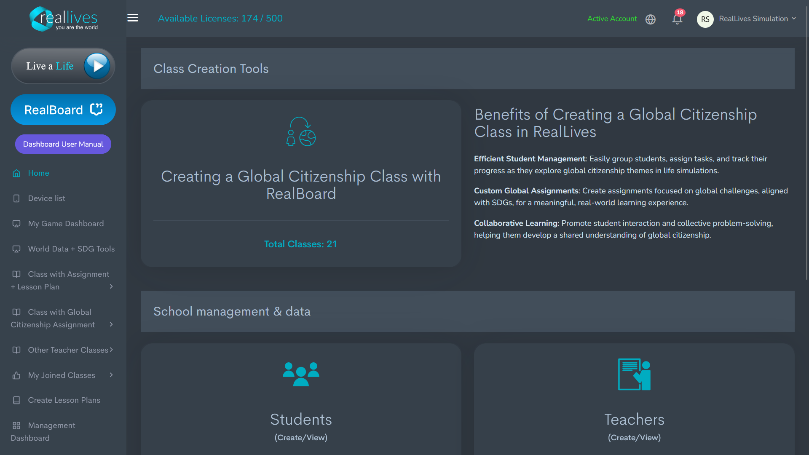
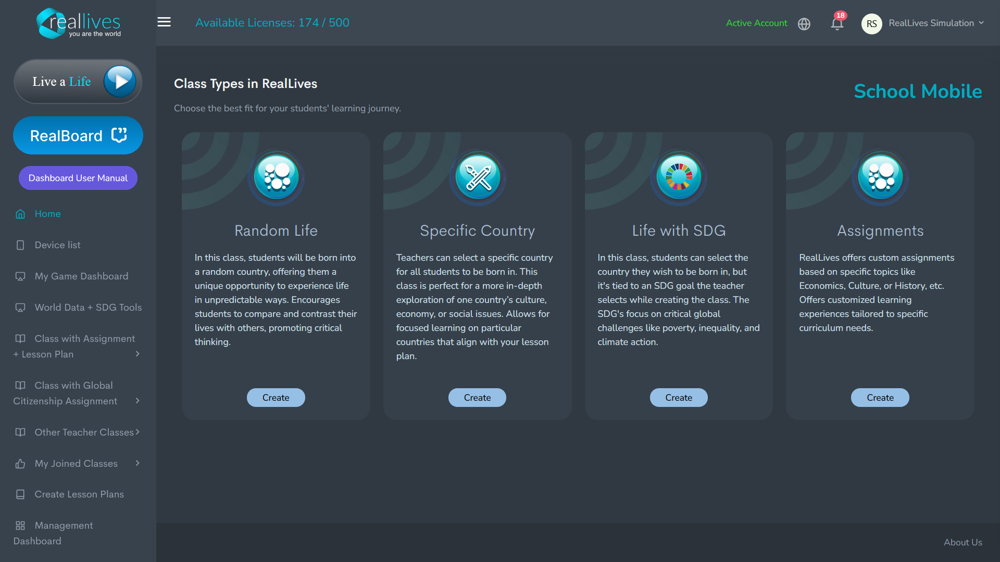
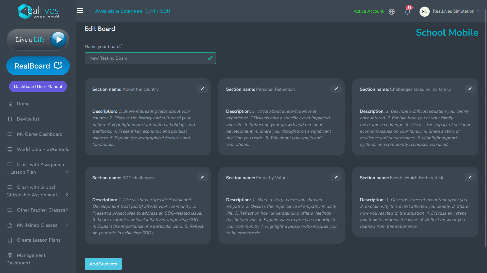
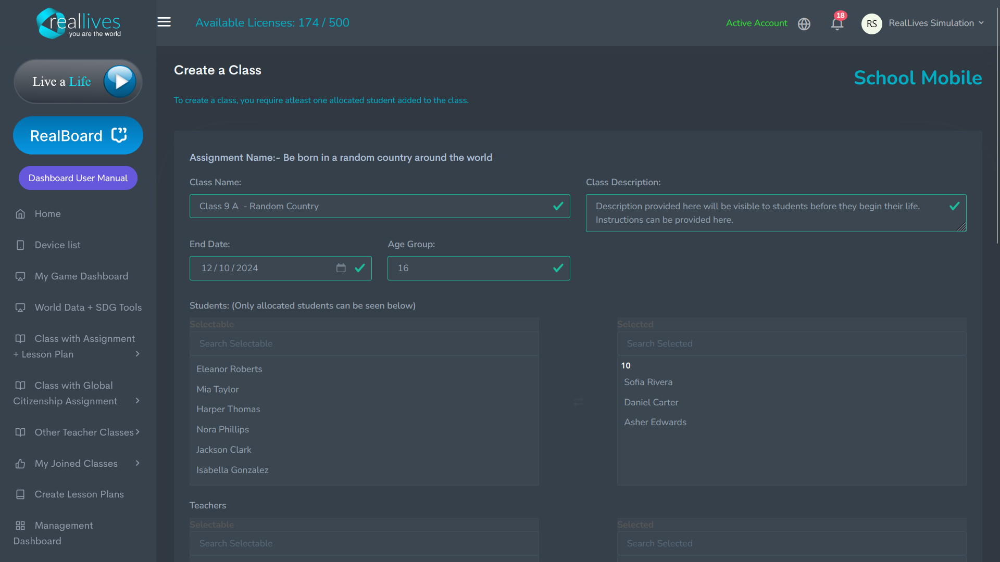
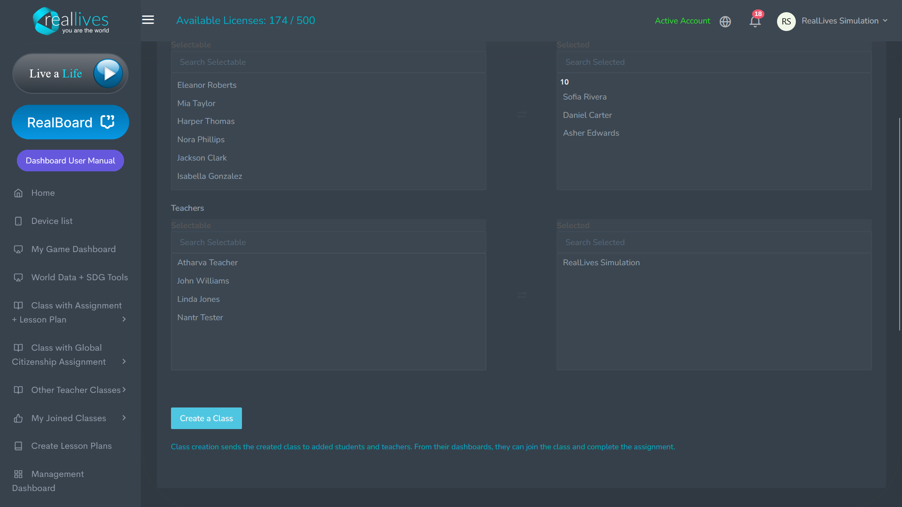
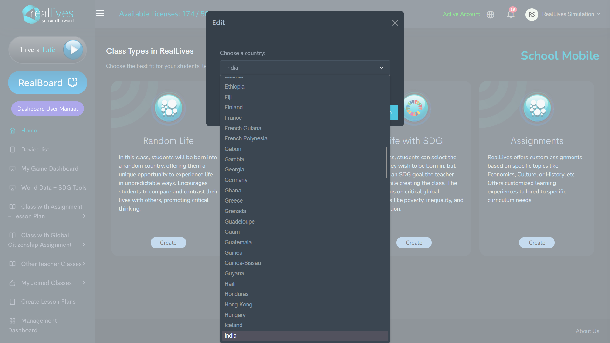
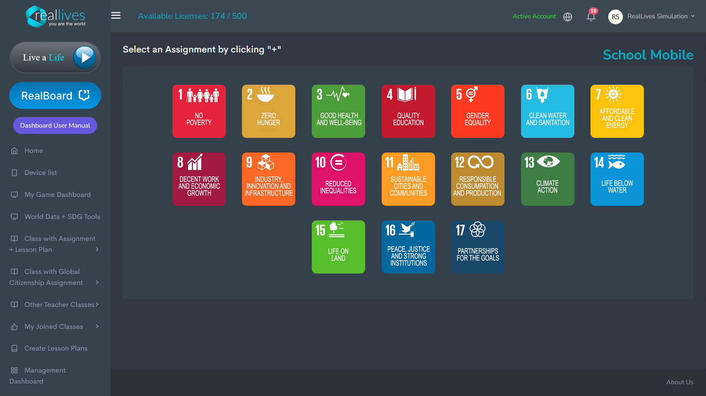
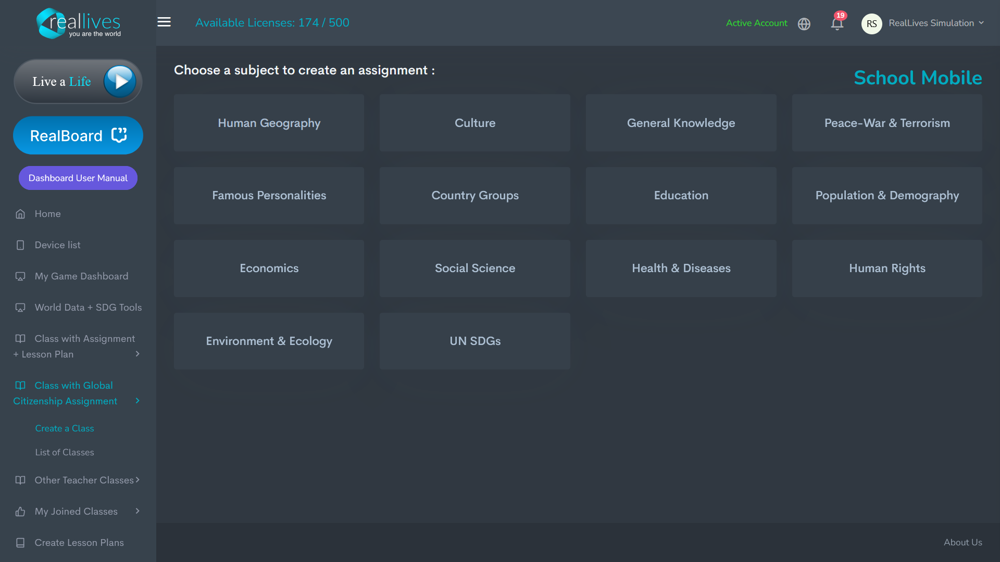
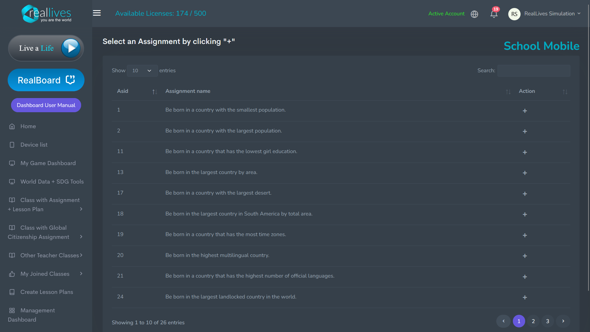

# Skapa en klass med RealBoard

Denna sektion förklarar hur lärare/professorer kan skapa en klass integrerad med RealBoard, vilket låter elever engagera sig i RealLives och dela sina reflektioner och inlärningsupplevelser i ett privat, skolbaserat socialt nätverk.

Om du är obekant med RealBoard, gå vidare till RealBoard-manualen -&#x20;

[RealBoard Manual](https://realboardmanual.reallivesworld.com/teacher-en)

## 1. Skapa en global medborgarskapsklass med RealBoard

### - Navigera till 'Verktyg för klasskapande'

* **Verktyg för klasskapande:** När du loggar in är den första sidan som syns under **RealBoard**-fliken **Verktyg för klasskapande**-dashboarden.
* Denna sida visar relevanta alternativ för att hantera klasser och elevframsteg.

### **- Klicka på 'Skapa en global medborgarskapsklass med RealBoard'**

* Den framträdande rutan med titeln **"Skapa en global medborgarskapsklass med RealBoard"** låter dig starta processen att skapa en ny klass med fokus på globalt medborgarskap.
* **Totala klasser:** Bredvid denna titel kommer lärare/professorer också att se en räknare som anger hur många klasser som för närvarande är aktiva (t.ex. "Totala klasser: 21").\

## **2. Välja klasser i RealLives**

### **- Översikt över klasstyper**

Efter att ha valt **Skapa en klass**, kommer du till sidan **Klasstyper**. Här kan du välja mellan fyra olika typer av klasser, var och en anpassad för olika pedagogiska mål och inlärningsresor.

### **- Välj den klasstyp som passar din lektionsplan**

Du kommer att se fyra olika alternativ för att skapa en klass, var och en med ett unikt syfte:

## **Slumpmässigt liv -**&#x20;

.png)

* **Beskrivning:** I denna klass föds eleverna i ett slumpmässigt land, vilket ger dem en oförutsägbar upplevelse av livet. Denna klasstyp uppmuntrar eleverna att jämföra och kontrastera sina liv med andras, vilket främjar kritiskt tänkande och mångfald i perspektiv.
* **Syfte:** Bäst för att främja diskussioner om global mångfald och öka empatin genom att placera elever i obekanta livssituationer.
* **Åtgärd:** Klicka på **Skapa**-knappen för att börja sätta upp din Slumpmässiga liv-klass.\

## **3. Redigera din klassbräda i RealBoard  :-**&#x20;

Efter att ha klickat på **Skapa**, låter sidan **Redigera bräda** dig anpassa och konfigurera din klassbräda genom att namnge den och lägga till sektioner för eleverna att engagera sig med. Så här använder du denna sida effektivt:

### **- Namnge din bräda**

* Längst upp på sidan ser du ett fält med titeln **"Namnge din bräda:"**.
* Ange ett lämpligt namn för din klassbräda (t.ex. **"Global medborgarskapsbräda"**, **"Miljöfrågeklass"**, eller **"Världskulturdiskussion"**).
* När du har angett namnet, klicka på **bockmarkeringen** för att spara det.

### **- Redigera brädsektioner och beskrivningar**

Varje klassbräda har fördefinierade sektioner som eleverna kommer att interagera med. Dessa sektioner kan anpassas för att passa de specifika målen och inlärningsresultaten för din klass.

**Hur man redigerar:** Klicka på **pennaikonen** till höger om sektionsrubriken för att ändra namn eller beskrivning. Anpassa denna sektion efter ditt klassfokus (t.ex. kan eleverna undersöka länder eller reflektera över nationella frågor).

## **4. Skapa en klass i RealBoard :-**&#x20;

Efter att ha valt klasstyp och redigerat brädan, låter denna slutliga sida dig konfigurera viktiga detaljer som klassens namn, beskrivning, elever, lärare/professorer och uppgiftsdatum.

**Steg 1: Ange klassnamn**

Längst upp på sidan ser du ett fält märkt **"Klassnamn:"**

* Ange ett lämpligt namn för din klass (t.ex. **Klass 9A - Slumpmässigt land**).
* Detta namn hjälper både dig och dina elever att enkelt identifiera klassen.

**Steg 2: Ställ in slutdatum**

Under klassnamnet kan du ställa in ett **Slutdatum** för klassen.

* Klicka på kalenderikonen för att välja lämpligt datum då klassuppgifter eller uppdrag ska vara slutförda.
* När du har valt, klicka på bockmarkeringen för att bekräfta datumet.

**Steg 3: Ange åldersgrupp**

I fältet **Åldersgrupp**, ange den relevanta åldersgruppen för eleverna som deltar i klassen (t.ex. 16 år).

**Steg 4: Lägg till klassbeskrivning**

I fältet **Klassbeskrivning**, kan du ge en översikt över vad klassen handlar om.

* **Exempel:** "Denna klass kommer att utforska livssimuleringar i slumpmässiga länder, vilket uppmuntrar kritiskt tänkande och global medvetenhet."
* Beskrivningen kommer att vara synlig för eleverna innan de påbörjar simuleringen. Instruktioner eller mål kan också anges här för att vägleda eleverna om vad de ska fokusera på under simuleringen.

**Steg 5: Lägg till elever**

**Välj elever:** I sektionen **Elever**, kan du välja vilka elever som ska inkluderas i klassen.

* På vänster sida, under **Valbara**, ser du en lista över elever som är inskrivna i systemet. Du kan söka eller bläddra för att hitta specifika elever.
* Klicka på en elevs namn för att lägga till dem i klassen. Deras namn kommer att flyttas till kolumnen **Valda** till höger.
* **Exempel:** Eleanor Roberts, Mia Taylor, Harper Thomas, etc.

**Steg 6: Lägg till lärare/professorer**

**Välj lärare/professorer:** Du kan också tilldela ytterligare lärare/professorer till klassen.

* Bläddra igenom eller sök efter lärare/professorer under **Valbara**. Klicka på namnen på de lärare/professorer som ska vara involverade i denna klass.
* Den valda läraren/professorn visas i kolumnen **Valda** till höger.
* **Exempel:** Atharva lärare, John Williams, Linda Jones, etc.

**Steg 7: Slutför skapandet av klassen**

När du har lagt till elever, lärare/professorer och slutfört övriga detaljer, klicka på knappen **Skapa en klass** längst ner på skärmen.

* Detta skapar klassen och meddelar automatiskt alla valda elever och lärare/professorer.
* De kan sedan logga in på RealBoard för att komma åt klassen och slutföra sina uppdrag.

## **5. Visa och hantera skapade klasser**

Efter att ha skapat din klass framgångsrikt, kommer du att omdirigeras till sidan **Skapa/Visa klasser med Globalt medborgarskapsuppdrag**. Här kan du hantera och visa alla klasser du har skapat eller är associerad med.

.png)

Längst upp kommer du att se en grön bekräftelserad som lyder **"Klasser sparades framgångsrikt."** Detta bekräftar att din nya klass har skapats och sparats i systemet.\

## **6. Notifikationer och åtkomst efter klasskapande**

### **- Elevnotifikationer**

När en klass har skapats kommer elever som har lagts till i klassen automatiskt att få en **notifikation** i sitt RealLives-konto.

 (5).png)

 (5).png)

* Denna notifikation informerar dem om att de har lagts till i en ny klass (t.ex. **Klass 9A - Slumpmässigt land**).
* Eleverna kan klicka på notifikationen för att visa klassen och börja spela sitt tilldelade livsscenario.

### **- Åtkomst till klassbrädan för lärare/professorer**

.png)

Lärare/professorer kan enkelt komma åt den bräda de har skapat genom att klicka på knappen **RealBoard** på vänstra sidomenyn i dashboarden.

* Därifrån kan de visa och hantera brädan, interagera med elevers inlägg, ge feedback och övervaka framsteg i uppgifterna.

## Klass typer i RealLives och deras unika funktioner

Medan den övergripande processen för att skapa en klass i RealLives förblir densamma—att lägga till ett brädnamn, redigera sektioner och ange klassdetaljer—introducerar den valda klasstypen unika funktioner som anpassar inlärningsupplevelsen till olika mål. Låt oss utforska hur varje klasstyp skiljer sig och vilka specifika möjligheter de erbjuder -&#x20;

\
Notera - Slumpmässigt liv diskuterades ovan.

## **Specifikt land**

.png)

* **Beskrivning:** Lärare/professorer kan välja ett specifikt land där alla elever kommer att födas. Detta är perfekt för djupgående utforskningar av landets kultur, ekonomi eller samhällsfrågor. Denna klasstyp stödjer en fokuserad fördjupning i specifika länder, idealiskt för geografi, ekonomi eller samhällsstudier.
* **Syfte:** Perfekt för lektioner som kräver detaljerad utforskning av en specifik region.
* **Åtgärd:** Klicka på **Skapa**-knappen för att börja sätta upp din klass för specifikt land.

I **Specifikt land**-klassen kan lärare/professorer välja ett specifikt land där alla elever kommer att födas. Detta möjliggör fokuserad utforskning av det landets kultur, ekonomi och samhällsfrågor.

* **Välja ett land:** Efter att ha valt **Specifikt land** som klasstyp, använd rullgardinsmenyn för att välja det land där dina elever ska födas.

Förutom valet av land, förblir resten av klasskapandeprocessen densamma som för **Slumpmässigt liv**. Vänligen hänvisa till flödet för **Slumpmässigt liv** ovan för detaljerade steg om hur man ställer in klassdetaljer, redigerar brädsektioner och lägger till elever och lärare/professorer.

## **Liv med SDG**

 (1).png)

* **Beskrivning:** I denna klass väljer eleverna ett land men är kopplade till ett specifikt **Hållbarhetsmål (SDG)**, såsom fattigdom, ojämlikhet eller klimatåtgärder.
* **Syfte:** Detta är den mest påverkningsfulla klasstypen för globalt medborgarskap, SDG-baserat lärande och att uppmuntra lösningar för globala utmaningar.
* **Åtgärd:** Klicka på **Skapa**-knappen för att börja designa din SDG-baserade klass.\

I **Liv med SDG**-klassen väljer läraren/professorn ett av de 17 hållbarhetsmålen (SDG) för att styra klassens fokus. Efter att ha valt ett mål (t.ex. **Klimatåtgärder**, **Ingen fattigdom**), kan eleverna:

* Välja vilket land de vill leva i.
* Utforska hur det valda SDG påverkar livet i olika regioner.
* Engagera sig med globala utmaningar på ett strukturerat men flexibelt sätt.

När läraren/professorn har ställt in det huvudsakliga SDG, kan eleverna ytterligare anpassa sin upplevelse genom att:

* Välja specifika delmål relaterade till det huvudsakliga SDG (t.ex. tillgång till sjukvård under **God hälsa och välbefinnande**).
* Förstå hur dessa utmaningar spelar ut i olika länder.

Denna klasstyp kombinerar verkliga globala frågor med friheten för eleverna att utforska effekterna av SDG i olika sammanhang. Resten av klasskapandeprocessen förblir densamma.

## **Uppdrag**

 (1).png)

* **Beskrivning:** Anpassade uppdrag baserade på ämnen som ekonomi, kultur, historia eller valfritt ämne. Lärare/professorer kan anpassa klasstypen genom att tilldela specifika mål, vilket tillåter elever att engagera sig med RealLives baserat på läroplanens behov.
* **Syfte:** Bäst för högt anpassade inlärningsupplevelser fokuserade på specifika läroplanskrav.
* **Åtgärd:** Klicka på **Skapa**-knappen för att börja sätta upp din klass för uppdrag.

För **Uppdrag**-klasstypen är processen som följer:

* **Steg 1: Välja ett ämne:** Läraren/professorn börjar med att välja ett ämne från de tillgängliga kategorierna (t.ex. **Mänsklig geografi**, **Ekonomi**, **Miljö och ekologi**). Detta ämne kommer att bilda grunden för uppdraget och vägleda inlärningsfokuset.
* **Steg 2: Välja ett uppdrag:** Efter att ha valt ett ämne kommer läraren/professorn att välja ett specifikt uppdrag från en lista. Dessa uppdrag är kopplade till specifika länder baserat på det valda ämnet (t.ex. "Födas i ett land med den största befolkningen" eller "Födas i ett land med lägst flickutbildning").
* **Steg 3: Elevernas upplevelse:** När uppdraget är inställt, kommer eleverna att uppleva livet i det land som är kopplat till det valda uppdraget, vilket gör att de kan utforska de utmaningar och dynamiker som är specifika för det landet.

Detta tillvägagångssätt tillåter lärare/professorer att anpassa uppdrag till lärandemål samtidigt som det erbjuder elever en fokuserad, landsspecifik simulering. Resten av klasskapandeprocessen förblir densamma.

