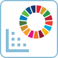

# 왼쪽 바

## <mark style="background-color:red;">대시보드의 왼쪽 바</mark>

### <mark style="background-color:red;">1. 홈</mark>

<figure><figcaption></figcaption></figure>

<figure><figcaption>
홈 페이지에서 아래로 스크롤한 후
</figcaption></figure>

### 홈 페이지는 학교/대학 관리자로서 사용할 수 있는 주요 기능에 대한 개요를 제공합니다.

1. **수업 생성 도구 -** **RealBoard를 통한 글로벌 시민 과제 클래스:** 학생들에게 다양한 과제와 임무를 부여할 수 있습니다. RealBoard로 수업을 생성하는 방법에 대한 자세한 정보는 이 섹션을 참조하세요 -


[create-a-class-with-realboard.md](../../undefined-1/create-a-class-with-realboard.md)


2. **학교/대학 관리 및 데이터 -** 학생 수와 상태를 확인할 수 있습니다. 교사/교수의 수와 상태도 확인할 수 있습니다. 학교/대학 게임 데이터는 생성한 모든 수업에 대한 통계와 데이터를 포괄적으로 보여줍니다. 개인 게임 데이터는 사용자가 직접 참여한 게임에 대한 통계와 정보를 포함합니다.

### <mark style="background-color:red;">2. 장치 목록</mark>

사용자의 계정이 로그인된 장치를 제어할 수 있습니다. RealLives는 학교/대학 관리자들이 3개의 다른 장치에서 계정을 사용할 수 있도록 허용합니다. 사용자가 어떤 이유로든 장치의 접근을 제거하고 싶다면 '장치 제거' 버튼을 클릭하여 제거할 수 있습니다.

<figure><figcaption></figcaption></figure>

### <mark style="background-color:red;">3. 내 게임 대시보드</mark>

게임 대시보드는 플레이어 통계, 업적, 진행 상황 추적 등 중요한 게임 정보를 표시하는 중앙 인터페이스입니다.

<figure><figcaption></figcaption></figure>

RealLives 내 게임 대시보드는 세 부분으로 나뉩니다 -

**내가 삶을 창조할 때 선택한 SDG (지속 가능한 개발 목표) -**

유엔의 지속 가능한 개발 목표(SDG)는 빈곤, 불평등, 기후 변화, 환경 악화 등 시급한 도전에 대응하기 위해 설정된 17개의 상호 연결된 글로벌 목표입니다. 삶을 플레이할 때 SDG를 선택하고 삶을 시작할 수 있습니다. 홈 페이지에서 'Live a Life'를 클릭한 후 페이지에 표시된 세 번째 옵션을 선택하면 됩니다.

<figure><figcaption></figcaption></figure>

#### 내가 기증한 장기 -

플레이한 모든 삶에서 기증한 장기의 수를 보여줍니다.

#### 내 게임 플레이 데이터 -

완료된 삶 또는 미완성된 삶에 대한 정보, 게임을 하면서 커버한 국가, 작성된 편지와 SDG 코멘트도 확인할 수 있습니다. 남성과 여성으로 나눈 삶의 수 또한 명시됩니다.

### <mark style="background-color:red;">4. 세계 데이터 + SDG 도구</mark>

**RealLives 세계 데이터 학습 도구**

<figure><figcaption></figcaption></figure>

### 1. 유엔 지속 가능한 개발 목표 (SDGs) 도구 

**설명:**

1\. 국가의 SDG 상태를 학습합니다.\
2\. 국가의 SDG 점수 및 순위를 비교합니다.\
3\. 국가 간 SDG 비교 문서 생성 도구.

### 2. 국가 격차 학습 도구 및 데이터 시각화 

**설명:**

두 국가를 비교하여 사회경제적, 건강 및 인구 통계 데이터를 시각화 및 동적 데이터 생성 문서를 통해 이해합니다.

### 3. 국가 데이터 비교 

**설명:**

로렌츠 곡선, 깨진 사다리 척도, SDG 도전 과제 및 국가 그룹을 통해 국가 데이터를 비교할 수 있는 완전한 도구입니다.

### 4. 국가 그룹 비교 

**설명:**

100개 이상의 국가 그룹을 체험합니다. 국가 그룹 내에서 국가 간의 격차에 대해 학습합니다.
